# Pruebas estructurales

## Tipos de pruebas de unidad

- Sin considerar detalles de implementación
	- Pruebas basadas en las especificaciones o modelos
- Considerando detalles de implementación
	- Errore de programación habituales
	- Pruebas estructurales
		- Pruebas dinámicas: implican ejecutar el código
		- Pruebas estáticas: revisiones de código
- Complementarias
	- Las pruebas estructurales incluyen casos que no pueden identificarse de la especificación, ejemplos:
		- Implementación de un elemento de la especificación en varias partes del programa
		- Errores en la estructura de datos elegida, colisiones en una tabla hash...
		- ...
	- Y viceversa
		- Caminos no implementados
		- ...

## Top 10 errors Java Programmers Make

1. Null pointers
1. Capitalization errors
1. Preventing concurrent access to shared variables by threads
1. Forgeting that Java is zero-indexed
1. Writing blank exception handlers
1. Confusion over passing by value and passing by reference
1. Comparing two objects (`==` instead of `.equals()`)
1. Comparison assignment (`=` rather than `==`)
1. Mistyping the name of a method when overriding
1. Accessing non-static member variables from static methods (such as `main()`)

## Pruebas estructurales

- Mejor para encontrar defectos que para explorar el comportamiento del sistema
- Si parte de un programa no ha sido ejecutado por ningún caso de prueba no podemos encontrar errores ahí
- Pero, en qué parte ? Dos enfoques:
	- Orientado al flujo de control
		- Cuánto del flujo de control ha sido analizado ?
	- Orientado al flujo de datos
		- Cuánto de la relación definición-uso de los datos ha sido analizado ?
- Complemento a las pruebas funcionales

## Las garantías de la cobertura

- El que se ejecuten todos los elementos del flujo de control no garantiza encontrar todos los errores
	- La ejecución de una sentencia errónea no siempre resulta en un fallo
		- Puede que el estado no esté corrupto cuando la sentencia es ejecutada con ciertos valores
		- Puede que estados corruptos no se propaguen para acabar produciendo un fallo
- Qué valor tiene la cobertura estructural ?
	- Incrementa la confianza en la amplitud de las pruebas

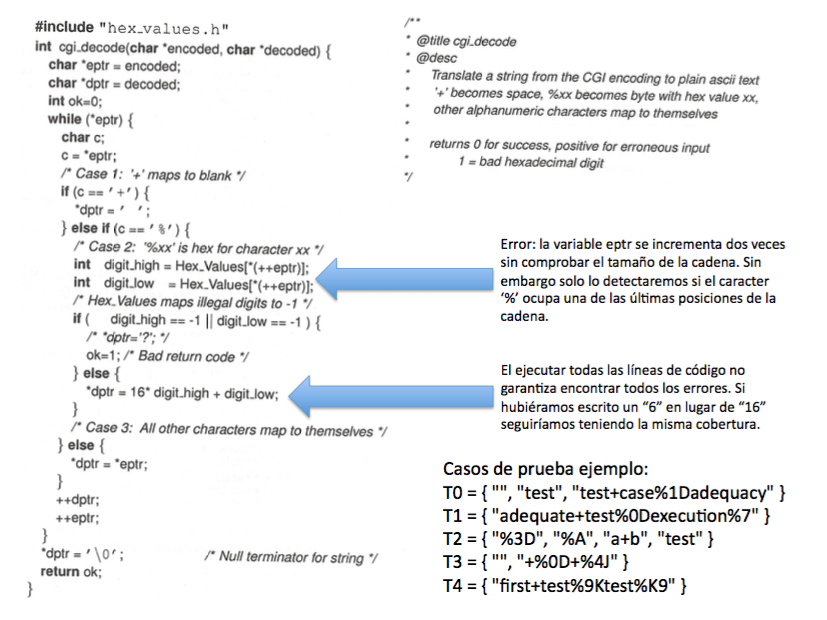

## Pruebas estructurales en la práctica

- Creamos las pruebas funcionales y a continuación medimos su cobertura para identificar lo que nos falta
- Identificamos elementos no ejecutados:
	- Debidos a diferencias entre la especificación y la implementación
	- O a errores en el software o en su proceso de desarrollo
		- Especificaciones incompletas, que no incluyen casos presentes en la implementación
		- Metodología de implementación muy diferente de la de especificación
		- Pruebas funcionales inadecuadas
- Automatizado: muy atractivo !
	- Medidas de cobertura representan indecadores de progreso
	- A veces utilizados como criterio de compleción
		- Hay que tener cuidado, no siempre pueden garantizar la efectividad !

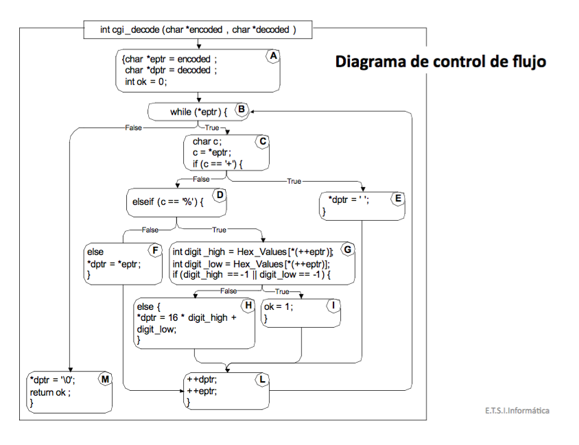

## Representaciones del software como grafos

- La ejecución del SW puede ser considerada como una secuencia de estados alternada con acciones (operaciones de la máquina, eventos...) que modifican el estado del sistema
- Utilizamos grafos para representar modelos de ejecución:
	- Opción 1: las acciones ocurren en los nodos del grafo y los arcos representan los estados del sistema durante las transferencias de flujos de control
	- Opción 2: un estado del sistema se representa por un nodo del grafo y las acciones ocurren en los arcos del grafo


## Diagramas de control de flujo

- Grafo de flujo __intra__-procedural:
	- Modela los caminos de control de flujo dentro de un procedimiento o método
	- Los nodos del grafo representan bloques de código
	- Los arcos del grafo representan caminos alternativos a las sentencias de código que podrían ejecutarse a continuación
- Grafo de flujo __inter__-procedural o __grafo de llamadas__:
	- Modela las secuencias de llamadas potenciales a varios métodos
	- Los nodos del grafo representan métodos
	- Los arcos del grafo indican que el método en el origen del arco puede llamar al método en el extremo del arco

## Grafos de flujo intraprocedural

- Qué se incluye en un nodo:
	- Una serie de sentencias con un único punto de entrada y un único punto de salida
		- Si hay varios puntos de entrada a una sentencia de código, la sentencia ha de ser la primera de un nodo
	- Si entras en un nodo todas las sentencias del nodo serán ejecutadas
		- Y las excepciones
- Los arcos se utilizan cuando hay alternativas a lo que podría ejecutarse a continuación, o para transferir el control a una sentencia para la que hay varios puntos de entrada
	- El diagrama debe hacer explícitas las condiciones para que se seleccione una u otra alternativa

### Basado en construcciones de lenguajes de programación

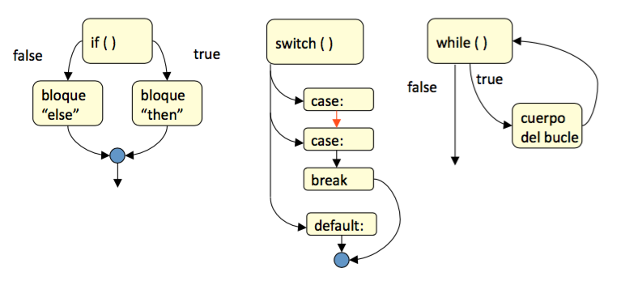

### Ejemplo Java

- Función: reemplazar `n` con `n >= 2`, retornos de carro consecutivos por uno y quitar todos los que aparezcan al principio

```java
public static String collapseNewLines(String arg) {
	char last = arg.charAt(0);
	StringBuilder buffer = new StringBuilder();
	
	for (int index = 0; index < arg.length(); index++) {
		char ch = arg.charAt(index);
		
		if (ch != '\n' || last != '\n') {
			buffer.append(ch);
			last = ch;
		}
	}
	
	return buffer.toString();
}
```

### Grafo de control de flujo


Notación alternativa

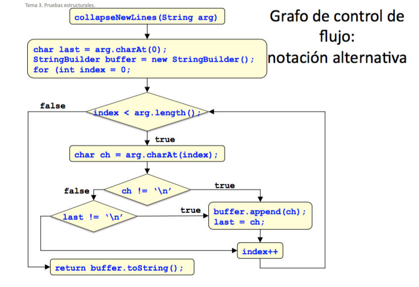

### Grafo de control de flujo

- El nivel de precisión puede variar dependiendo de cada caso
- Importa la evaluación de cortocircuitos ?
	- `if (a != null && a.algo())`
		- Sí, previene de excepciones por puntero null
	- `if (a > 36 && a < 72)`
		- El orden de evaluación no es relevante
- Deberían considerarse las excepciones
	- Sí, siempre

### Ejemplo

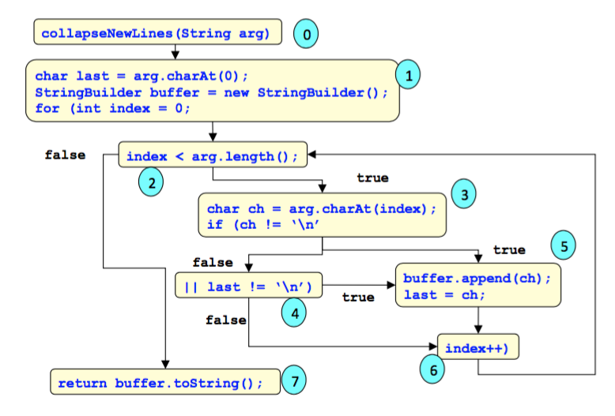

- Propósito del grafo:
	- Derivamos casos de prueba para ejecutar los diferentes caminos
	- Si hubiera un número infinito (o muy grande) de caminos tendremos que utilizar algún tipo de criterio de selección para elegir un subconjunto
	- Para cada camino determinaremos qué datos de entrada son necesarios
- Algunos de los posibles caminos de ejecución:
	- 1 - 2 - 7
		- In: `""`
		- Out: `""`
	- 1 - 2 - 3 - 4 - 6 - 2 - 7
		- In: `"\n"`
		- Out: `""`
	- 1 - 2 - 3 - 5 - 6 - 2 - 7
		- In: `"a"`
		- Out: `"a"`
	- 1 - 2 - 3 - 4 - 5 - 6 - 2 - 7
		- In: `!`
		- Out: `null`
	- 1 - 2 - 3 - 4 - 6 - 2 - 3 - 4 - 6 - 2 - 7
		- In: `"\n\n"`
		- Out: `""`
	- 1 - 2 - 3 - 5 - 6 - 2 - 3 - 4 - 6 - 2 - 7
		- In: `!`
		- Out: `null`
	- 1 - 2 - 3 - 5 - 6 - 2 - 3 - 5 - 6 - 2 - 3 - 4 - 6 - 2 - 7
		- In: `"a\n\n"`
		- Out: `"a\n"`

## Grafos de llamadas interprocedurales

- Muestra las relaciones entre métodos llamantes y llamados
- En lenguajes orientados a objetos con polimorfismo el determinar los métodos que se van a ejecutar no es fácil
	- Hay una subclase que redefine un método ?
	- Llama el método redefinido al método de la superclase ?
	- Se está usando un objeto factoría que devuelve objetos de diferentes tipos ?

### Ejemplo

```java
public class C {
	public static C cFactory(String kind) {
		if (kind.equals("C"))
			return new C();
		
		if (kind.equals("S"))
			return new S();
		
		return null;
	}
	
	public static void main(String[] args) {
		(new A()).check();
	}
	
	void foo() {
		System.out.println("Parent foo() called");
	}
	
	class S extends C {
		void foo() {
			System.out.println("Child foo() called");
		}
	}
	
	class A {
		void check() {
			C myC = C.cFactory("S");
			myC.foo();
		}
	}
}
```

### Grafos de llamadas

- Con vinculación dinámica solo podemos determinar cuál de los métodos `C.foo()` y `S.foo()` será invocado en tiempo de ejecución
- Podemos analizar el código y determinar que se llamará a `S.foo()`, pero un analizador estático de código no siempre podrá determinarlo
- Con análisis estático, debemos considerar la posibilidad de que si un método `foo()` es invocado sobre una variable de tipo `C` entonces la versión de `foo()` ejecutada puede ser una de:
	- Una subclase de `C`, si `C` tiene subclases, o
	- Una implementación de `C`, si `C` es una interfaz

### Los grafos de llamadas y los contextos

```java
public class C {
	public static void main(String[] args) {
		C myC = new C();
		myC.foo(3);
		myC.foo(17);
	}
	
	void foo(int n) {
		int[] myArray = new int[n];
		depends(myArray, 2);
	}
	
	void bar(int n) {
		int[] myArray = new int[n];
		depends(myArray, 2);
	}
	
	void depends(int[] a, int n) {
		a[n] = 42; // Podemos decir si existe a[n] ?
	}
}
```

- Un grafo sensible al contexto muestra el contexto de parámetros en el que un método es invocado
	- En este caso, el grafo sensible al contexto puede ayudar a responder a la pregutna "exite `a[n]` ?" en `depends()`

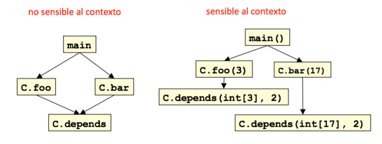

### Caminos en los grafos de llamadas


- Hay 4 contextos diferentes en los que el método F puede ser invocado
- El número de contextos puede crecer rápidamente, incluso sin recursión...

## Criterios de cobertura para código

- Sentencias
- Ramas
- Condiciones (básicas)
- Ramas y condiciones
- Condiciones compuestas
- Condiciones/decisiones modificado
- Caminos
- Caminos interiores
- Bucles
- Complejidad ciclomática
- Llamadas a procedimientos
- ...

## Cobertura de las sentencias

- Criterio: cada sentencia (o nodo del GCF) ha de ejecutarse al menos una vez
- Cobertura: `numero_de_sentencias_ejecutadas / numero_de_sentencias`
- Intuición: un fallo en una sentencia puede ser detectado solo ejecutando dicha sentencia
- No siempre es posible alcanzar cobertura 1
- Diferencia entre sentencias y bloques: granularidad
	- 100% cobertura de nodos `<====>` 100% cobertura de sentencias
	- No coincidirá para valores menores de 100


## Cobertura de ramas

- Criterio: cada rama (arista en el GCF) ha de ejecutarse al menos una vez
- Cobertura: `numero_de_ramas_ejecutadas / numero_de_ramas`
- Intuición: número de ramas ejecutadas por un conjunto de pruebas
- No siempre es posible alcanzar sobertura 1
- Si cubrimos todas las ramas de un grafo visitamos todos los nodos
	- 100% cobertura de ramas `====>` 100% cobertura de sentencias

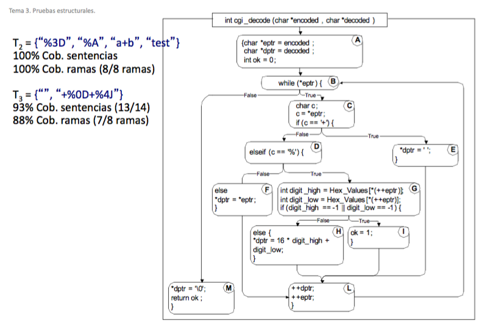

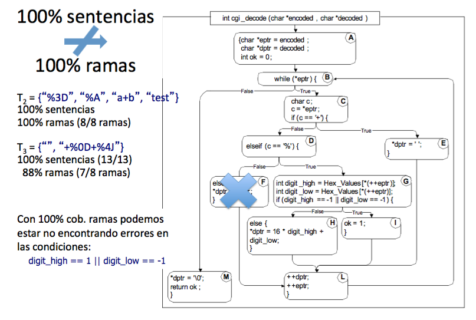

## Cobertura de condiciones (básicas)

- Criterio: cada condición básica ha de tomar valor `true` para al menos un caso de prueba y `false` para al menos un caso de prueba
- Cobertura: `numero_de_valores_de_verdad_tomados_por_cada_condicion_basica / (2 * numero_de_condiciones_basicas)`
- Intuición: las pruebas hacen que cada condición tome valores `true` y `false`

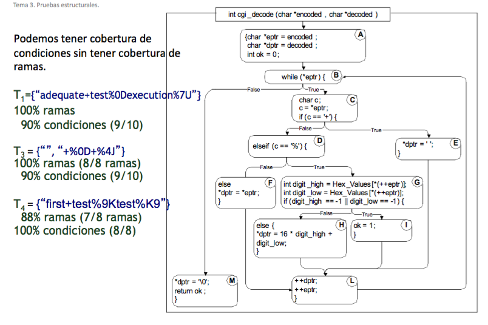

## Cobertura de ramas y condiciones

- Cobertura de ramas y condiciones
	- Cubre todas las ramas y todas las condiciones
- Cobertura de condiciones compuestas
	- Criterio
		- Cubre todas las posibles evaluaciones de condiciones compuestas
		- Cubre todas las ramas del árbol de decisión
		- Exponencial, incluso con cortocircuito

## Criterio de condiciones compuestas

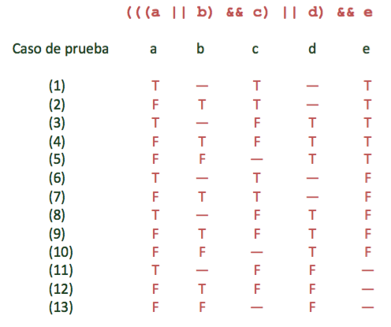

- El cortocircuito puede reducir el número de casos, pero no siempre...
	- Una condición con 16 condiciones puede requerir 32000 casos de prueba

## Criterio de condiciones/decisiones modificado: MC/DC

- Probamos combinaciones relevantes de las condiciones, sin el crecimiento exponencial en el número de pruebas
	- Cada condición básica que afecta independientemente a la decisión
- Requiere 2 casos de prueba para cada condición básica
	- Las evaluaciones del resto de las condiciones básicas son los mismos
	- La condición compuesta se evalúa con valores distintos


### MC/DC: complejidad lineal

- `N + 1` casos de prueba para `N` condiciones básicas


- Buen equilibrio entre cobertura y número de casos
	- Menos estricto que el criterio de condiciones compuestas, pero más que el resto de los criterios discutidos
- Requerido por estándares de calidad internacionales en aviación (*RTCA/DO-178B* y *EUROCAE ED-12B*)

## Cobertura de caminos

- Criterio: cada camino ha de ejecutarse al menos una vez
- Cobertura: `numero_de_caminos_ejecutados / numero_de_caminos`
- Intuición:
	- Más caminos que ramas
	- Los criterios basados en decisiones y condiciones consideran las decisiones individualmente
	- El criterio basado en caminos considera combinaciones de decisiones a lo largo de los caminos

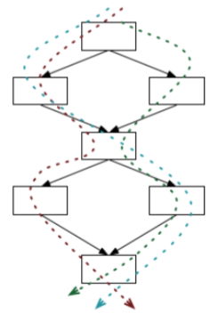

### Cobertura de caminos en la práctica

- El número de caminos en un programa con bucles es infinito
	- Criterio imposible de satisfacer
- Compromiso: particionamos el conjunto infinito de caminos en un número finito de clases de caminos
- Limitamos:
	- El número de iteraciones de los bucles
	- La longitud de los caminos a recorrer
	- Las dependencias entre caminos seleccionados

### Caminos interiores

- Agrupamos los caminos que se diferencian solo en el subcamino que siguen cuando repiten el cuerpo del bucle
	- Seguimos el flujo de control hasta el primer nodo que se repite
	- Cubrimos el conjunto de caminos desde la raíz del árbol hasta cada hoja

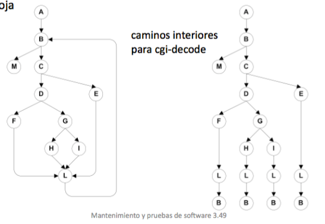

### Limitaciones del criterio de caminos interiores

- El número de caminos puede crecer exponencialmente incluso sin bucles
	- `N` ramas suponen `2^N` caminos
	- Deducir los datos de entrada puede ser muy complicado, incluso imposible si las condiciones no son independientes

```java
if (a) {
	S1;
}

if (b) {
	S2;
}

if (d) {
	S3;
}

// ...

if (x) {
	Sn;
}
```

## Criterio de los bucles

- Variante del criterio de los caminos interiores que trata de la misma forma los bucles pero es menos exigente con otros caminos
- Criterio: un test suite satisface el criterio de los bucles si cada bucle:
	- En al menos un caso de prueba el cuerpo del bucle se repite 0 veces
	- En al menos un caso de prueba el cuerpo del bucle se repite 1 vez
	- En al menos un caso de prueba el cuerpo del bucle se repite más de una vez

## Criterio de la complejidad ciclomática

- Criterio: se ha ejecutado un número de caminos independientes mayor que la complejidad ciclomática

## Criterio de llamadas a procedimientos

- Pruebas de entradas y salidas de procedimientos
	- Procedimientos pueden tener múltiples puntos de entrada y múltiples puntos de salida
- Cobertura de invocaciones
	- Un mismo método puede ser invocado desde distintos puntos

## Satisfacción de los criterios estructurales

- Algunas veces es imposible alcanzar coberturas del 100%
	- Sentencias que no pueden ejecutarse
		- Programación defensiva
		- Reutilización de código (p.ej. más general de lo necesario)
	- Condiciones que no pueden satisfacerse
		- Condiciones interdependientes
	- Caminos que no pueden ejecutarse
		- Decisiones interdependientes
- Código muerto puede indicar un problema de mantenibilidad
	- Habitual incluso en aplicaciones bien diseñadas y bien mantenidas
- Soluciones
	- Establecer objetivos de cobertura inferiores al 100%
	- Requerir justificación de elementos no cubiertos
		- Estándares *RTCA-DO-178B* y *EUROCAE ED-12B* para MC/DC

## Pruebas basadas en los flujos de datos

- Pruebas basadas en los flujos de control
	- Las coberturas de nodos y ramas no tienen en cuenta las interacciones entre instrucciones
	- Las coberturas basadas en condiciones y caminos son impracticables
		- Enorme número de casos de prueba
- Pruebas basadas en los flujos de datos
	- Necesitamos centrarnos en los caminos "importantes"
	- Las instrucciones interaccionan a lo largo de flujos de datos
	- Criterios basados en la forma en que las variables son definidas y utilizadas
		- Los valores calculados en una sentencia son utilizaod en otra
		- Los cálculos incorrectos solo se revelan cuando se utilizan

### Flujo de datos

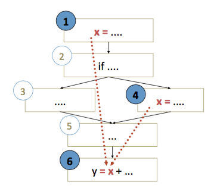

- El valor de `x` en 6 podría ser calculado en 1 o en 4
- Un error en 1 o en 4 se desvelaría solo si fuesen usadas en 6
- *def*: instrucción que asigna un valor a una variable
- *uso*: instrucción que usa una variable
- Par *def-uso* (DU):
	- (1,6)
	- (4,6)

### Pares y caminos DU

- Par DU: par de definición y uso de alguna variable tal que hay al menos un camino DU entre la definición y el uso
	- `x = ...`: es una definición de `x`
	- `... x ...`: es un uso de `x`
- Camino DU: un camino sin definiciones en el GFC desde una definición a un uso de la misma variable
	- "Sin definiciones": el valor no se cambia en el camino
	- Los bucles podrían crear infinitos caminos DU

### Caminos sin definiciones

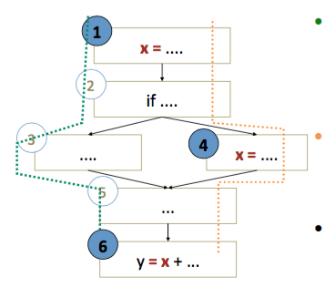

- 1 - 2 - 3 - 5 - 6
	- Es un camino sin definiciones (para `x`) de 1 a 6
		- A `x` no se le (re-)asigna ningún valor entre 1 y 6
- 1 - 2 - 4 - 5 - 6
	- No es un camino sin definiciones (para `x`) de 1 a 6
		- A `x` se le asigna un valor en 4
- (1,6) es un par DU (para `x`) porque `1 - 2 - 3 - 5 - 6` es un camino DU sin definiciones (para `x`)


### Variables, punteros y estructuras

- Casos difíciles
	- `x[i] = ...; ...; y = x[j];`
		- Par DU (solo) si `i == j`
	- `p = &x; ...; *p = 99; ...; q = x;`
		- `*p` es un alias de `x`
	- `m.putX(...); ...; y = n.getX(...);`
		- Son `m` y `n` el mismo objeto ?
		- Comparten `m` y `n` el atributo `x` ?
- Arrays y punteros son críticos para análisis de flujo de datos
	- Infra-estimación puede hacer que se nos escapen pares DU
	- Sobre-estimación puede hacer que sea irrealizable

### Criterios de cobertura

- __Pares DU__: cada par DU ha de ser ejecutado por al menos un caso de prueba
- __Caminos DU__: cada camino DU simple (un bucle) ha de ser ejecutado por al menos un caso de prueba
- __Definiciones__: para cada definición, hay al menos un caso de prueba que ejecuta un par DU que lo contiene
	- Cada valor computado es usado al menos una vez

### Ejemplo: funciones estadísticas

```java
public static void computeStats(int[] numbers) {
	int length = numbers.length;
	double med, var, sd, mean, sum, varsum;
	
	sum = 0.0;
	for (int i = 0; i < length; i++) {
		sum += numbers[i];
	}
	
	med = numbers[length / 2];
	mean = sum / length;
	
	varsum = 0.0;
	for (int i = 0; i < length; i++) {
		varsum = varsum + ((numbers[i] - mean) * (numbers[i] - mean));
	}
	
	var = varsum / (length - 1.0);
	sd = Math.sqrt(var);
	
	System.out.println("length: " + length);
	System.out.println("mean: " + mean);
	System.out.println("median: " + median);
	System.out.println("variance: " + var);
	System.out.println("standard deviation: " + sd);
}
```

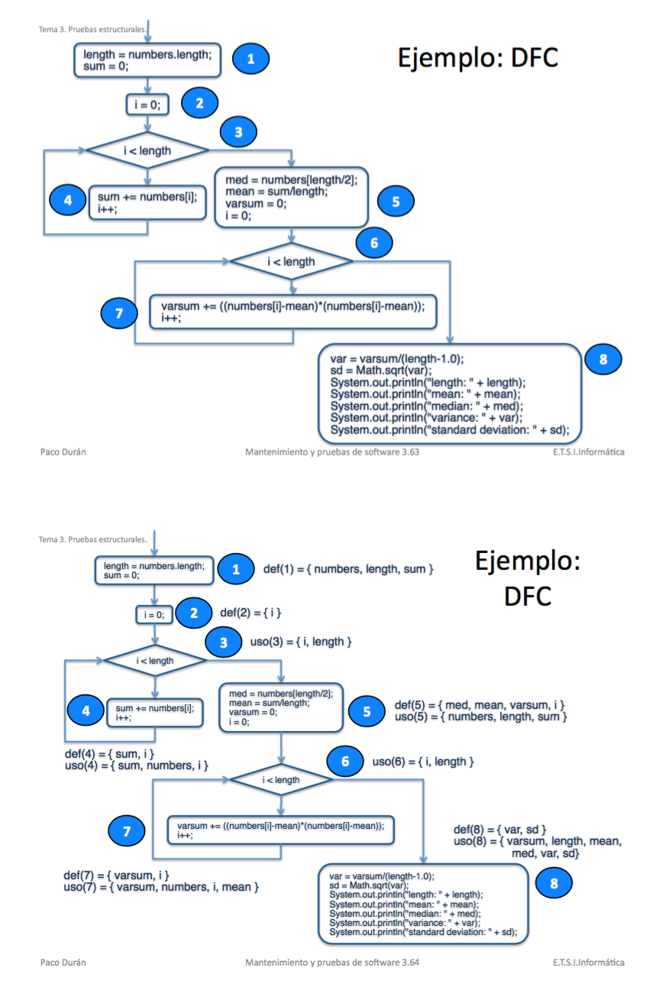


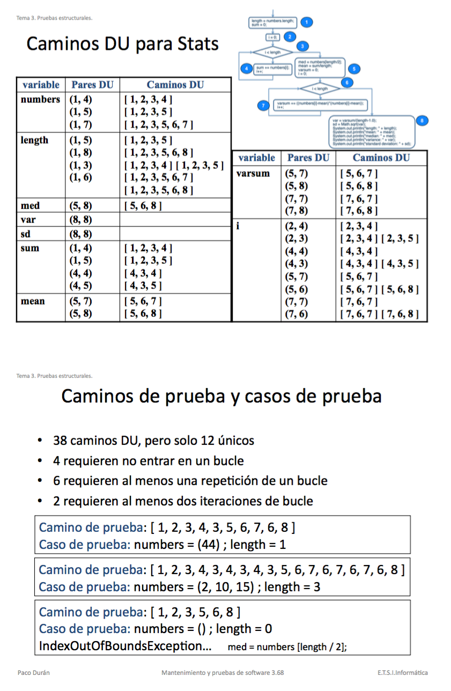
